---
# https://github.com/slidevjs/slidev/blob/v51.1.1/packages/types/src/config.ts#L10
theme:  apple-basic
layout: intro-image
image: ./pictures/bg-initial.png
title: Global Network Observability with goProbe
---
<style>
h2 code {
  color: black;
}
</style>

## Global Network Observability with `goProbe` and `goQuery`

_Bärner Go Meetup, 27.03.2025_

<br/>

Lennart Elsen

Fabian Kohn

<br/>

**Observability Team @ Open Systems AG**


---
layout: two-cols
---

# Lennart Elsen

Systems/Software Engineer at Open Systems
> Observability, Fleet Management, Traffic Analysis, `golang`

Born and raised in Hamburg, Germany
> Zurich, ZH, CH

Surfing, Coffee and Open Source Software
> South Shore Beach, RI, US, Double Espresso (no cream, no sugar), [els0r/goProbe](https://github.com/els0r/goProbe)

::right::

<div style="justify-self: center">

</div>


---
layout: two-cols
---

# Fabian Kohn

Systems/Software Engineer at Open Systems
> Performance Optimization, High-Energy Physics, Traffic Analysis, `golang`

Born and raised in Göttingen, Germany
> Hamburg, HH, DE

Running, Coffee and Open Source Software
> Everywhere, Flat White, [fako1024/slimcap](https://github.com/fako1024/slimcap)

::right::

<div style="justify-self: center">

</div>


---
layout: default
---

<div class="flex h-screen justify-center">
  <div class="w-1/3 flex flex-col items-center">
    <div>Internet Traffic</div>
    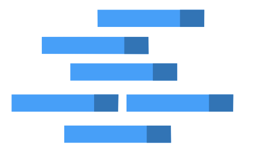
  </div>
  <div class="w-1/3 flex flex-col items-center">
    <div></div>
  </div>
  <div class="w-1/3 flex flex-col items-center">
    <div></div>
  </div>
</div>

---
layout: default
---

<div class="flex h-screen justify-center">
  <div class="w-1/3 flex flex-col items-center">
    <div>Internet Traffic</div>
    
  </div>
  <div class="w-1/3 flex flex-col items-center">
    <div></div>
  </div>
  <div class="w-1/3 flex flex-col items-center">
    <div>Customer</div>
    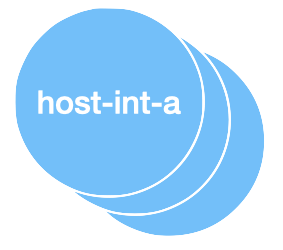
  </div>
</div>

---
layout: default
---

<div class="flex h-screen justify-center">
  <div class="w-1/3 flex flex-col items-center">
    <div>Internet Traffic</div>
    
  </div>
  <div class="w-1/3 flex flex-col items-center">
    <div>Open Systems</div>
    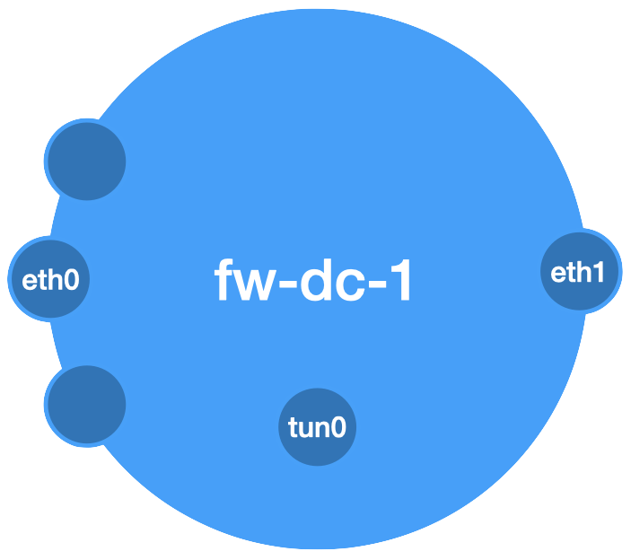
  </div>
  <div class="w-1/3 flex flex-col items-center">
    <div>Customer</div>
    
  </div>
</div>

---
layout: default
---

<div class="flex h-screen justify-center">
  <div class="w-1/3 flex flex-col items-center">
    <div class="text-center">What's the traffic composition?</div>
    
  </div>
  <div class="w-1/3 flex flex-col items-center opacity-20">
    <div class="opacity-0">Open Systems</div>
    
  </div>
  <div class="w-1/3 flex flex-col items-center opacity-20">
    <div class="opacity-0">Customer</div>
    
  </div>
</div>

---
layout: image
---

# An IP packet

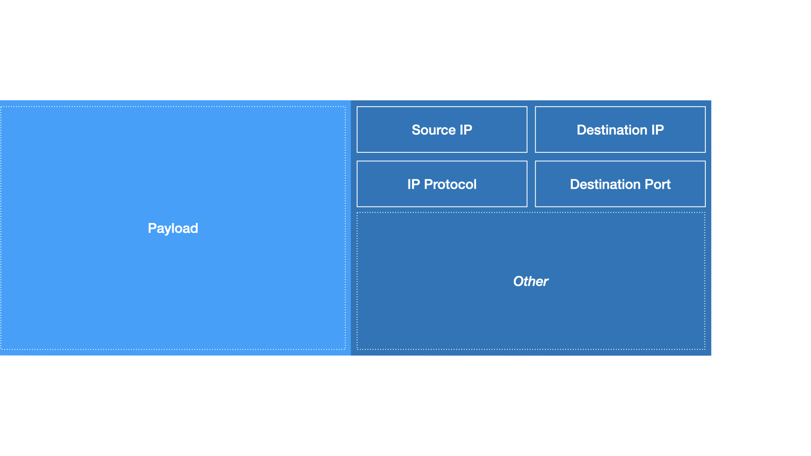

---
layout: default
---

# For `t == now`

Live capture

```shell
tcpdump -ni eth0
```

---
layout: default
---

# For `t == now`

Live capture

```shell
tcpdump -ni eth0
```

Output

```
tcpdump: verbose output suppressed, use -v[v]... for full protocol decode
listening on eth0, link-type EN10MB (Ethernet), snapshot length 262144 bytes
11:33:16.002178 IP 211.154.236.12.35178 > 10.236.2.18.22: Flags [.], ack 188, win 83, options [nop,nop,TS val 515841640 ecr 3570605299], length 0
11:33:16.021053 IP 211.154.236.12.35178 > 10.236.2.18.22: Flags [P.], seq 1:37, ack 188, win 83, options [nop,nop,TS val 515841659 ecr 3570605299], length 36
11:33:16.021268 IP 10.236.2.18.22 > 211.154.236.12.35178: Flags [P.], seq 188:224, ack 37, win 83, options [nop,nop,TS val 3570605320 ecr 515841659], length 36
```

---
layout: default
---

# For `t == now`

Live capture

```shell
tcpdump -ni eth0
```

What a network engineer looks at

<style>
  pre.text-focus {
    color: #bbb;
  }
  pre.text-focus mark {
    background-color: transparent;
  }
</style>

<pre class="slidev-code text-focus" style="font-size:12px">
tcpdump: verbose output suppressed, use -v[v]... for full protocol decode
listening on eth0, link-type EN10MB (Ethernet), snapshot length 262144 bytes
<mark>11:33:16.002178</mark> IP <mark>211.154.236.12</mark>.35178 <mark>> 10.236.2.18</mark>.<mark>22</mark>: Flags [.], ack 188, win 83, options [nop,nop,TS val 515841640 ecr 3570605299], length 0
<mark>11:33:16.021053</mark> IP <mark>211.154.236.12</mark>.35178 <mark>> 10.236.2.18</mark>.<mark>22</mark>: Flags [P.], seq 1:37, ack 188, win 83, options [nop,nop,TS val 515841659 ecr 3570605299], length 36
<mark>11:33:16.021268</mark> IP <mark>10.236.2.18</mark>.<mark>22 > 211.154.236.12</mark>.35178: Flags [P.], seq 188:224, ack 37, win 83, options [nop,nop,TS val 3570605320 ecr 515841659], length 36
</pre>

---
layout: default
---

# For `t == now`

Live capture

```shell
tcpdump -ni eth0
```

What a network engineer looks at

<style>
  pre.text-focus {
    color: #bbb;
  }
  pre.text-focus mark {
    background-color: transparent;
  }
</style>

<pre class="slidev-code text-focus" style="font-size:12px">
tcpdump: verbose output suppressed, use -v[v]... for full protocol decode
listening on eth0, link-type EN10MB (Ethernet), snapshot length 262144 bytes
<mark>11:33:16.002178</mark> IP <mark>211.154.236.12</mark>.35178 <mark>> 10.236.2.18</mark>.<mark>22</mark>: Flags [.], ack 188, win 83, options [nop,nop,TS val 515841640 ecr 3570605299], length 0
<mark>11:33:16.021053</mark> IP <mark>211.154.236.12</mark>.35178 <mark>> 10.236.2.18</mark>.<mark>22</mark>: Flags [P.], seq 1:37, ack 188, win 83, options [nop,nop,TS val 515841659 ecr 3570605299], length 36
<mark>11:33:16.021268</mark> IP <mark>10.236.2.18</mark>.<mark>22 > 211.154.236.12</mark>.35178: Flags [P.], seq 188:224, ack 37, win 83, options [nop,nop,TS val 3570605320 ecr 515841659], length 36
</pre>

_Bi-directional traffic (SSH session) from 211.154.236.12 to 10.236.2.18_

---
layout: fact
---

_Bi-directional traffic_

_(SSH session, TCP port 22)_

_from 211.154.236.12_

_to 10.236.2.18_

---
layout: default
---

# For `t == now - 24h`?

Did we run

```shell
tcpdump -ni eth0 -w eth0.pcap
```

?

---
layout: default
---

# For `t == now - 24h`?

Did we run

```
out of disk space
```

?

---
layout: default
---

# For `t == now - 24h`?

What if we had captured the metadata?


---
layout: default
---

# For `t == now - 24h`?

What if we queried the metadata?

````md magic-move
```
query -i eth0 -f -24h -c "dip=10.236.2.18 and sip=211.154.236.12 and dport=22 and proto=tcp" sip,dip,dport,proto
```
```
goquery -i eth0 -f -24h -c "dip=10.236.2.18 and sip=211.154.236.12 and dport=22 and proto=tcp" sip,dip,dport,proto

                                             packets  packets             bytes      bytes
             sip          dip  dport  proto       in      out       %        in        out       %
  211.154.236.12  10.236.2.18     22    TCP    481      475    100.00  59.27 kB   65.91 kB  100.00

                                               481      475            59.27 kB   65.91 kB

         Totals:                                        956                      125.18 kB

Timespan    : [2025-03-10 11:47:03, 2025-03-11 11:50:00] (1d3m0s)
Interface   : eth0
Sorted by   : accumulated data volume (sent and received)
Conditions  : (dip = 10.236.2.18 & (sip = 211.154.236.12 & (dport = 22 & proto = tcp)))
Query stats : displayed top 1 hits out of 1 in 9ms
```
````

---
layout: two-cols
---

### Write Path

::right::

### Read Path

---
layout: two-cols
---

### Write Path
* continuous capture of network metadata

::right::

### Read Path
* a means to query it

---
layout: two-cols
---

### Write Path
* continuous capture of network metadata
* low footprint, non-invasive

::right::

### Read Path
* a means to query it
* low read-latency

---
layout: fact
---

## Isn't this a **solved** problem?

---
layout: fact
---

## Yes.
## It is.

---
layout: fact
---

## Yes,
## BUT

---
layout: fact
---

## low footprint, non-invasive

## low read-latency


---
layout: two-cols
---

`goProbe`

### Write Path
* continuous capture of network metadata
* low footprint, non-invasive

`goQuery`

### Read Path
* a means to query it
* low read-latency

::right::

<div class="flex w-[50%] h-[70%] justify-center items-center">
 <div class="translate-x-[15%] translate-y-[10%]">
  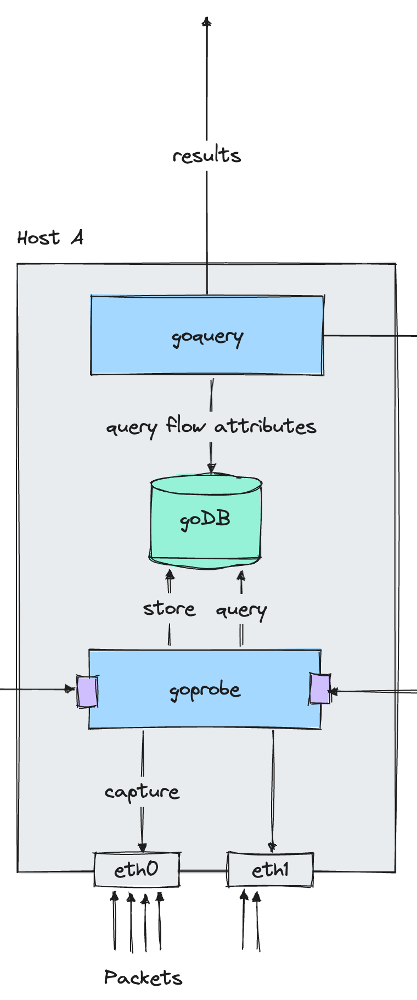
 </div>
</div>


---
layout: fact
---

# Capture

## `goProbe`

---
---

## Next-Gen Packet Capture

Previous capture solution (`goProbe` v3):
* Does <u>a lot</u> *[more than we need]* under the hood
* Complex / intricate to use (stateful `pcap` capture handle vs. <u>lots</u> of interfaces)
* `C(GO)` / system library dependency (`libpcap`)
* Customizations / fork required
* Abysmal testing capabilities

---
layout: image
image: ./pictures/slimcap/fine.jpg
---

---
layout: fact
---

## low footprint, non-invasive

## <span class="color-coolgray">low read-latency</span>

---
layout: two-cols
---

## Next-Gen Packet Capture

Minimize Overhead:
* IP Layer extraction (if exists)
* Limit to start of transport layer

Linux only (but keep extensible)

Native Go, no external [read: `C(GO)`] dependencies

~~Easy~~ Trivial to use (semi-stateless)

Zero-copy / zero-allocation support

Out-of-the-box tests / benchmarks

::right::

<div class="flex justify-center items-center">
 <div class="translate-y-[80%]">
  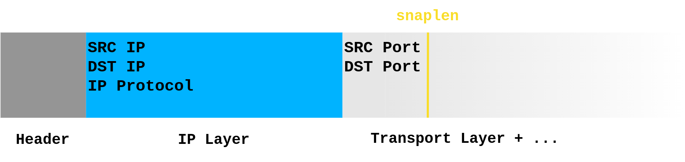
 </div>
</div>

---

## Capture Setup
### AF_PACKET & MMAP()

<div class="flex justify-center items-center">
 <div class="w-[70%] translate-y-[3%]">
  
 </div>
</div>

---

## Capture Setup
### AF_PACKET & MMAP()

<div class="flex justify-center items-center">
 <div class="w-[70%] translate-y-[3%]">
  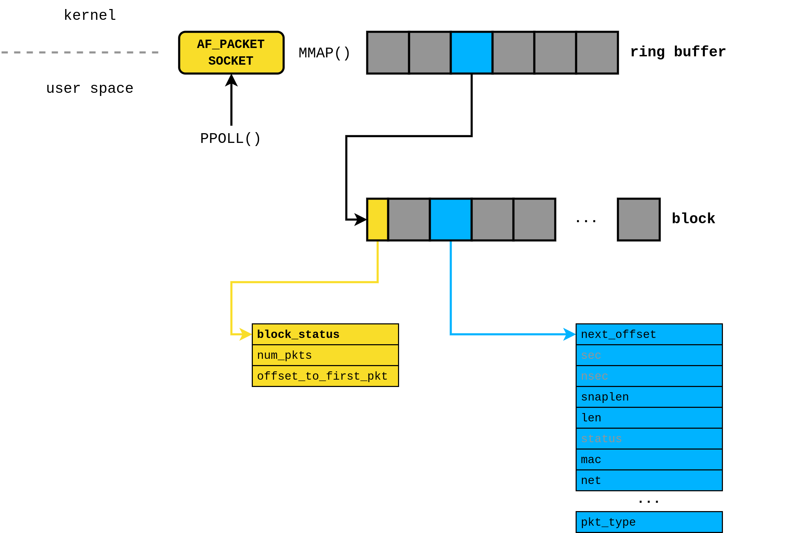
 </div>
</div>

---

## Capture Setup
### AF_PACKET & MMAP()

<div class="flex justify-center items-center">
 <div class="w-[70%] translate-y-[3%]">
  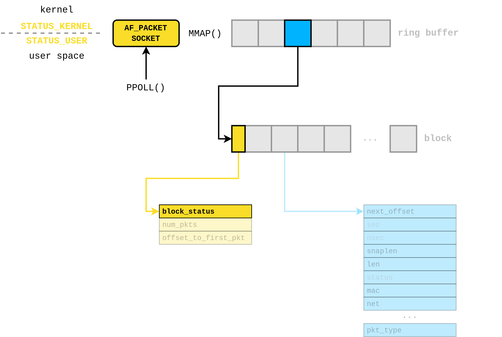
 </div>
</div>

---

## Capture Setup
### Filtering

**BPF**[^bpf] Let kernel do the heavy lifting (filter valid IPv4 / IPv6 packets)

```go
// LinkTypeLoopback
// not outbound && (ether proto 0x0800 || ether proto 0x86DD)
var bpfInstructionsLinkTypeLoopback = func(snapLen int) ([]bpf.RawInstruction) {
    return []bpf.RawInstruction{
        {Op: opLDH, Jt: 0x0, Jf: 0x0, K: regPktType},        // Load pktType
        {Op: opJEQ, Jt: 0x4, Jf: 0x0, K: pktTypeOutbound},   // Skip duplicate "OUTBOUND" packets
        {Op: opLDH, Jt: 0x0, Jf: 0x0, K: regEtherType},      // Load byte 12 from the packet (ethernet type)
        {Op: opJEQ, Jt: 0x1, Jf: 0x0, K: etherTypeIPv4},     // Check for IPv4 header
        {Op: opJEQ, Jt: 0x0, Jf: 0x1, K: etherTypeIPv6},     // Check for IPv6 header
        {Op: opRET, Jt: 0x0, Jf: 0x0, K: uint32(snapLen)},   // Return up to snapLen bytes of the packet
        {Op: opRET, Jt: 0x0, Jf: 0x0, K: 0x0},               // Return (no data)
    }
}
```

[^bpf]: https://en.wikipedia.org/wiki/Berkeley_Packet_Filter

---

## Interfaces

````md magic-move
```go
// Source denotes a generic packet capture source
type Source interface {
    NextPacket(pBuf Packet) (Packet, error)
    NextPayload(pBuf []byte) ([]byte, byte, uint32, error)
    NextIPPacket(pBuf IPLayer) (IPLayer, PacketType, uint32, error)
    NextPacketFn(func(payload []byte, totalLen uint32, pktType PacketType, ipLayerOffset byte) error) error

    Stats() (Stats, error)
    Close() error
    // ...
}
```
```go
// SourceZeroCopy denotes a capture source that supports zero-copy operations
type SourceZeroCopy interface {
    NextPayloadZeroCopy() ([]byte, PacketType, uint32, error)
    NextIPPacketZeroCopy() (IPLayer, PacketType, uint32, error)

    // Wrap generic Source
    Source
}
```
````

---

## Minimal Example

````md magic-move
```go {1,2,8}
src, err := afring.NewSource(
    “enp1s0”,
    afring.CaptureLength(link.CaptureLengthMinimalIPv4Transport),
    afring.BufferSize(
        1024*1024,       // Block Size
        4,               // Number of Blocks
    ),
)

if err != nil {
    // Error handling
}
```
```go {1,3,8}
src, err := afring.NewSource(
    “enp1s0”,
    afring.CaptureLength(link.CaptureLengthMinimalIPv4Transport),
    afring.BufferSize(
        1024*1024,       // Block Size
        4,               // Number of Blocks
    ),
)

if err != nil {
    // Error handling
}
```
```go {1,4-8}
src, err := afring.NewSource(
    “enp1s0”,
    afring.CaptureLength(link.CaptureLengthMinimalIPv4Transport),
    afring.BufferSize(
        1024*1024,       // Block Size
        4,               // Number of Blocks
    ),
)

if err != nil {
    // Error handling
}
```
```go
src, err := afring.NewSource(
    “enp1s0”,
    afring.CaptureLength(link.CaptureLengthMinimalIPv4Transport),
    afring.BufferSize(
        1024*1024,       // Block Size
        4,               // Number of Blocks
    ),
)

if err != nil {
    // Error handling
}
```
````

---

## Minimal Example (cont'd)

````md magic-move
```go
for {
    ipLayer, pktType, pktLen, err := src.NextIPPacketZeroCopy()
    if err != nil {
        if errors.Is(err, capture.ErrCaptureStopped) {
            // Graceful stop
            break
        }
        // Error handling
    }
}
```
```go
for {
    ipLayer, pktType, pktLen, err := src.NextIPPacketZeroCopy()
    if err != nil {
        if errors.Is(err, capture.ErrCaptureStopped) {
            // Graceful stop
            break
        }
        // Error handling
    }

    // Do stuff ...
    _ = ipLayer        // Raw IP layer data (up to snaplen)
    _ = pktType        // Packet Type (direction flag)
    _ = pktLen         // Total packet length
}
```
````

---
layout: two-cols
---

## Integration
### Capture Rotation

During data writeout (flow map “rotation”) in `goProbe`:

* Fundamentally concurrency-safe read / write<br>
  <span class="color-coolgray">Permanent overhead</span>

      OR

* Interrupt capture during rotation<br>
  <span class="color-coolgray">Potential ring buffer overflow</span>

::right::

<div class="flex w-[80%] justify-center items-center">
 <div class="translate-x-[15%] translate-y-[10%]">
  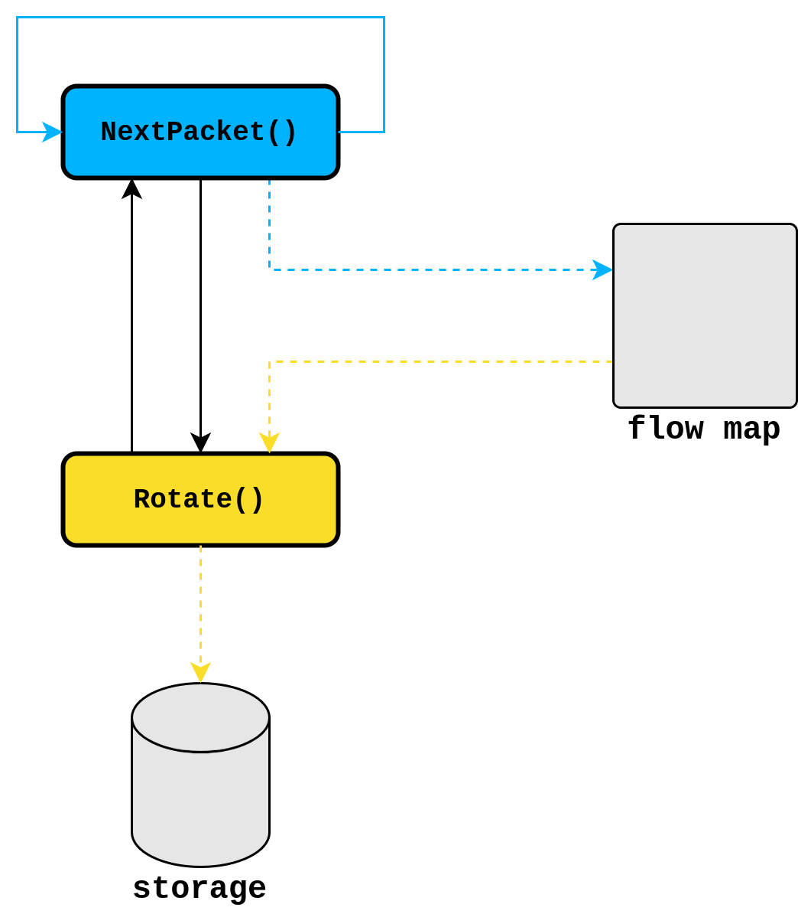
 </div>
</div>

---
layout: two-cols
---

## Integration
### Capture Rotation

During data writeout (flow map “rotation”) in `goProbe`:

* Fundamentally concurrency-safe read / write<br>
  <span class="color-coolgray">Permanent overhead</span>

      OR

* Interrupt capture during rotation<br>
  <span class="color-coolgray">Potential ring buffer overflow</span>

Mitigation:

* Sequential rotation of interfaces
* Additional (shared) local buffer
* Packet processing & parsing while buffering

::right::

<div class="flex w-[80%] justify-center items-center">
 <div class="translate-x-[15%] translate-y-[10%]">
  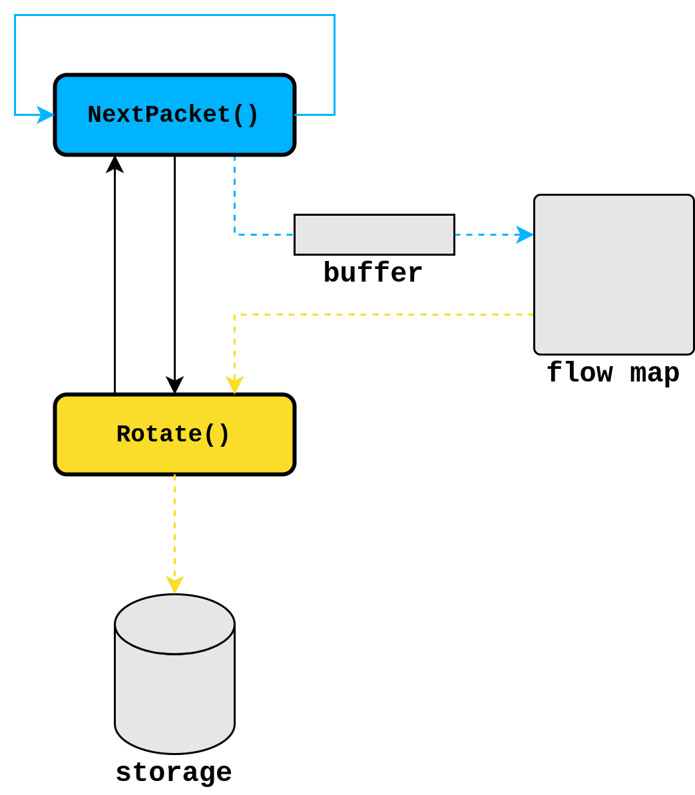
 </div>
</div>

---

## Testing
### Mock Capture Sources

Stand-in wrappers (down to socket interaction) around actual sources:
* `AF_PACKET` socket vs. simple FD / EFD semaphore
* `MMAP`’ed area vs. user space slice
* Memory barrier vs. atomic status flag / field

<div class="flex justify-center items-center">
 <div class="w-[90%] translate-y-[20%]">
  
 </div>
</div>

---

## Testing
### Mock Capture Sources

Stand-in wrappers (down to socket interaction) around actual sources:
* `AF_PACKET` socket vs. simple FD / EFD semaphore
* `MMAP`’ed area vs. user space slice
* Memory barrier vs. atomic status flag / field

Features:
* Reading & replay of pcap dumps (no timing)
* Synthetic packet / payload generation
* No privileges (or *actual* interfaces)
* Piping from other mock sources
* High-throughput mode (benchmarks)

---

## Testing
### Benchmarks

**Testbed:** Production Host (DC Firewall)

**Scenario:** 1h Real-life capture `goProbe` v3 (`gopacket`) / v4 (`slimcap`), 676.9 M packets

<div class="w-[70%] translate-x-[10%] translate-y-[20%] grid gap-1">
  <div class="grid grid-cols-[1.5fr_1fr_1fr_1fr_1fr]">
    <span>CPU Time:</span>
    <span class="text-right">43:17.7 min</span>
    <span class="text-right">vs.</span>
    <span class="text-right">1:57.7 min</span>
    <span class="text-right color-blue">~ x22</span>
  </div>
  <div class="grid grid-cols-[1.5fr_1fr_1fr_1fr_1fr]">
    <span>Peak Mem Usage:</span>
    <span class="text-right">150 MiB</span>
    <span class="text-right">vs.</span>
    <span class="text-right">153 MiB</span>
    <span class="text-right color-blue">~ x1</span>
  </div>
  <div class="grid grid-cols-[1.5fr_1fr_1fr_1fr_1fr]">
    <span>Dropped Packets:</span>
    <span class="text-right">98 k</span>
    <span class="text-right">vs.</span>
    <span class="text-right">0</span>
    <span class="text-right color-blue"></span>
  </div>
</div>

---
layout: fact
---

# Read Path

## `goQuery`

---
---

# Local Queries
### A `Row` of metadata

Load only what you need

````md magic-move
```
goquery -i eth0 -f -24h -c "sip=211.154.236.12 and dport=22 and proto=tcp" dip
```
``` {1,3}
goquery -i eth0

eth0/
```
``` {1,3,4}
goquery -i eth0 -f -24h

eth0/
  2025/03/1742860800
    sip.gpf
    dip.gpf
    dport.gpf
    proto.gpf

    bytes_rcvd.gpf
    bytes_sent.gpf
    pkts_rcvd.gpf
    pkts_sent.gpf
```
``` {1,3,4,6,10-14}
goquery -i eth0 -f -24h dip

eth0/
  2025/03/1742860800
    sip.gpf
    dip.gpf
    dport.gpf
    proto.gpf

    bytes_rcvd.gpf
    bytes_sent.gpf
    pkts_rcvd.gpf
    pkts_sent.gpf
```
```
goquery -i eth0 -f -24h -c "sip=211.154.236.12 and dport=22 and proto=tcp" dip

eth0/
  2025/03/1742860800
    sip.gpf
    dip.gpf
    dport.gpf
    proto.gpf

    bytes_rcvd.gpf
    bytes_sent.gpf
    pkts_rcvd.gpf
    pkts_sent.gpf
```
````

---
layout: fact
---

````md magic-move
```
(SSH session, TCP port 22)

from 211.154.236.12

on hostA
```
```
(SSH session, TCP port 22)

from 211.154.236.12

on all hosts
```
````

---
---

<div class="flex justify-center items-center">
 <div class="w-[100%]">
  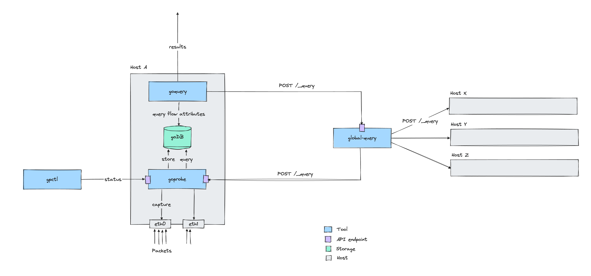
 </div>
</div>

---
---

<div class="flex justify-center items-center">
 <div class="w-[100%]">
  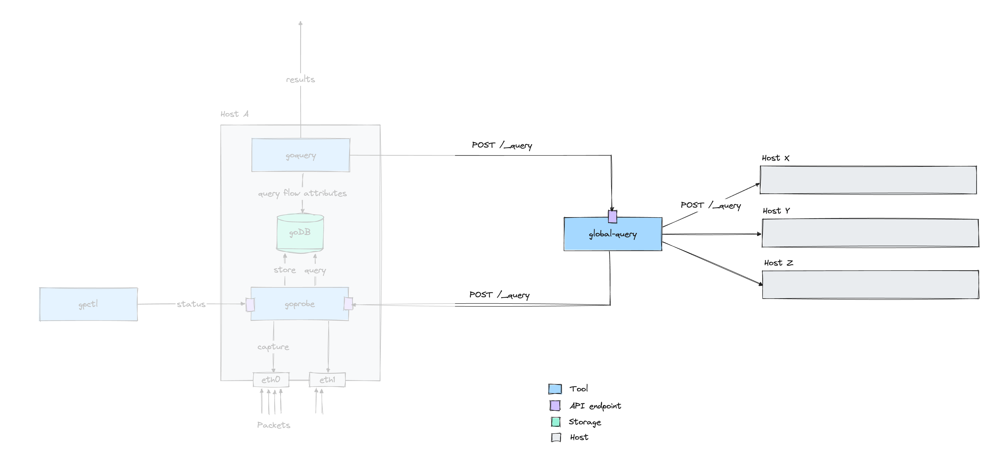
 </div>
</div>

---
layout: two-cols
---

# Global Queries
### A `Row` of metadata

````md magic-move
```go
type Row struct {
    // Labels
    Timestamp time.Time
    Iface string
    Hostname string
    HostID string
}
```
```go {1,8,9,10,11,12,13}
type Row struct {
    // Labels
    Timestamp time.Time
    Iface string
    Hostname string
    HostID string

    // Attributes
    SrcIP   netip.Addr
    DstIP   netip.Addr
    IPProto uint8
    DstPort uint16
}
```
```go {1,13,14,15,16,17,18,19}
type Row struct {
    // Labels
    Timestamp time.Time
    Iface string
    Hostname string
    HostID string

    // Attributes
    SrcIP   netip.Addr
    DstIP   netip.Addr
    IPProto uint8
    DstPort uint16

    // Counters
    BytesRcvd   uint64
    BytesSent   uint64
    PacketsRcvd uint64
    PacketsSent uint64
}
```
```go
type Row struct {
    // Labels are the partition Attributes
    Labels Labels

    // Attributes which can be grouped by
    Attributes Attributes

    // Counters for bytes/packets
    Counters types.Counters
}
```
```go {1,2,6}
type Row struct {
    MergeableAttributes

    // Counters for bytes/packets
    Counters types.Counters
}
```
````

---
---

# Global Queries
### A first class data structure for flow aggregation

````md magic-move
```go
// RowsMap is an aggregated representation of a Rows list
type RowsMap map[MergeableAttributes]types.Counters
```
````

---
---

### Which systems did `211.154.236.12` access via SSH?

---
---

### Which systems did `211.154.236.12` access via SSH?

````md magic-move
```
goquery -i eth0 -f -24h -c "sip=211.154.236.12 and dport=22 and proto=tcp" dip
```
```
goquery -i eth0 -f -24h -c "sip=211.154.236.12 and dport=22 and proto=tcp" dip -q hostA,hostB,...,hostK
```
```
goquery -i eth0 -f -24h -c "sip=211.154.236.12 and dport=22 and proto=tcp" dip -q hostA,hostB,...,hostK

                                      packets   packets             bytes      bytes
                 host           dip        in       out      %         in        out      %
            acme-sg-1   10.236.2.19   55.11 k   56.80 k  32.01    7.30 MB   17.92 MB  18.16
            acme-sg-2   10.236.2.20   69.14 k   62.46 k  37.65    6.46 MB    7.57 MB  10.10
    acme-node4-test-1  10.236.50.32    7.25 k    4.54 k   3.37   10.92 MB  731.57 kB   8.37
    acme-node1-test-1  10.236.50.30    5.82 k    1.75 k   2.16   11.38 MB  159.01 kB   8.31
    acme-node2-test-1   10.236.50.2    5.08 k    1.36 k   1.84   11.34 MB  133.30 kB   8.25
    acme-node3-test-1  10.236.50.31    3.70 k    1.08 k   1.37   10.60 MB  115.16 kB   7.71
            acme-sg-6  10.236.50.17    5.04 k    1.82 k   1.96    9.70 MB  189.60 kB   7.12
   acme-node4-ch-zh-1  10.236.48.26    4.85 k    1.09 k   1.70    9.71 MB  145.36 kB   7.09
   acme-node3-ch-zh-1   10.236.48.7    5.38 k    1.07 k   1.84    9.70 MB  111.05 kB   7.06
   acme-node1-ch-zh-1   10.236.48.5    3.96 k    1.10 k   1.45    9.64 MB  141.61 kB   7.04
            acme-sg-3   10.236.50.7    3.61 k    1.37 k   1.42    9.58 MB  131.51 kB   6.99
            acme-sg-4   10.236.2.59   19.89 k   17.63 k  10.73    1.97 MB    2.38 MB   3.13
            acme-sg-5   10.236.2.18    4.53 k    4.17 k   2.49  459.46 kB  495.22 kB   0.67

                                     193.32 k  156.25 k         108.75 MB   30.17 MB

              Totals:                          349.57 k                    138.92 MB

Timespan          : [2025-03-24 10:33:35, 2025-03-25 10:35:00] (1d1m0s)
Interface / Hosts : eth0 on 34 hosts: 25 ok / 0 empty / 9 error
```
```
goquery -i eth0 -f -24h -c "sip=211.154.236.12 and dport=22 and proto=tcp" dip -q hostA,hostB,...,hostK

Timespan          : [2025-03-24 10:33:35, 2025-03-25 10:35:00] (1d1m0s)
Interface / Hosts : eth0 on 34 hosts: 25 ok / 0 empty / 9 error
Query stats       : displayed top 13 hits out of 13 in 10.196s
Trace ID          : c7c51c6e5c463716cedcb69bd40a36e4
```
``` {4,5}
goquery -i eth0 -f -24h -c "sip=211.154.236.12 and dport=22 and proto=tcp" dip -q hostA,hostB,...,hostK

Timespan          : [2025-03-24 10:33:35, 2025-03-25 10:35:00] (1d1m0s)
Interface / Hosts : eth0 on 34 hosts: 25 ok / 0 empty / 9 error
Query stats       : displayed top 13 hits out of 13 in 10.196s
Trace ID          : c7c51c6e5c463716cedcb69bd40a36e4
```
````

---

## Global Network Observability

---

## Global Network Observability

### Troubleshooting

* historic traffic patterns across the WAN path
  * did `A` access `B`?
  * did `A` get blocked?
  * is there asymmetric routing?

* biggest bandwidth hogs in WAN fleet


---

## Global Network Observability

### Troubleshooting

* historic traffic patterns across the WAN path
  * did `A` access `B`?
  * did `A` get blocked?
  * is there asymmetric routing?

* biggest bandwidth hogs in WAN fleet

### Security

* am I affected?
* has malicious actor with IP `x.y.z.a` accessed any systems?


---
# https://github.com/slidevjs/slidev/blob/v51.1.1/packages/types/src/config.ts#L10
layout: intro-image
image: ./pictures/bg-initial.png
---

# Thank You


---
# https://github.com/slidevjs/slidev/blob/v51.1.1/packages/types/src/config.ts#L10
layout: intro-image
image: ./pictures/bg-initial.png
---
<style>
code {
  color: black;
}
</style>

# Want to Contribute?

* [open an issue](https://github.com/els0r/goProbe/issues)

* PRs welcome. See `good first issue`

---

# Backup

---

## Testing
### Benchmarks

**Testbed:** Quad-core Odroid H3, 32 GiB RAM

**Scenario:** Synthetic mock benchmark (zero-copy packet retrieval) on `slimcap`

<div class="w-[45%] translate-x-[10%] translate-y-[20%] grid gap-1">
  <div class="grid grid-cols-3">
    <span>Time / op:</span>
    <span class="text-right">16.2 ns</span>
    <span class="text-right color-coolgray">± 1%</span>
  </div>
  <div class="grid grid-cols-3">
    <span>Throughput:</span>
    <span class="text-right">61.7 Mpps</span>
    <span class="text-right color-coolgray">± 1%</span>
  </div>
  <div class="grid grid-cols-3">
    <span>Allocations / op:</span>
    <span class="text-right">0</span>
    <span class="text-right"></span>
  </div>
</div>

---
